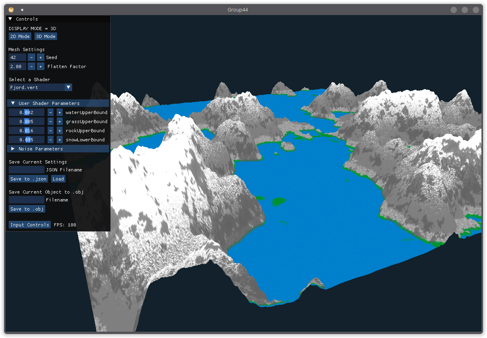
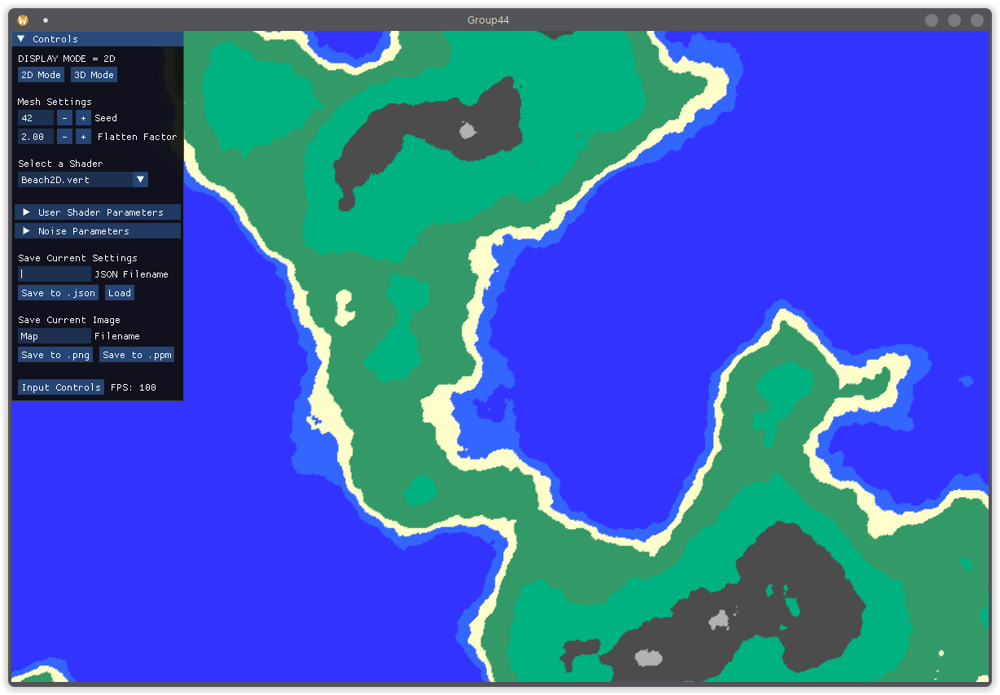
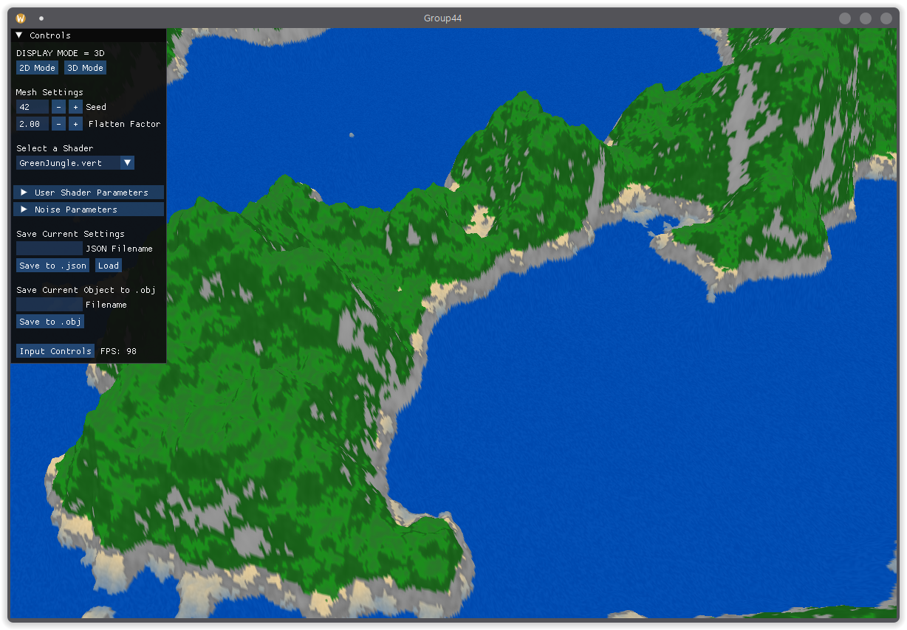

# Group 44 - Procedural Noise Generation

<!-- { width=800px } -->


Team members:

- Stefan Dan [stefan.dan@tum.de](mailto:stefan.dan@tum.de)
- Dominik Bereżański [ge63nem@mytum.de](mailto:ge63nem@mytum.de)
- Pawel Kedzia [pawel.kedzia@tum.de](mailto:pawel.kedzia@tum.de)

The project is 'Procedural Terrain Generation with Perlin Noise' described in https://gitlab.lrz.de/tum-i05/public/advprog-project-ideas/-/blob/master/procedural-terrain-generation/perlin-noise-procedural-terrain-generation.md?ref_type=heads

## Note on external packages

In **Sprint 2** we added a graphical user interface (GUI) and rendering with OpenGL. Therefore, the project uses a handful of external libraries, which we have taken from the internet, without modifying any of them. These libraries are located in the `graphicsExternal` folder. They are

- `glad` https://glad.dav1d.de/
- `glfw-3.4` https://www.glfw.org/
- `glm` https://www.opengl.org/sdk/libs/GLM/
- `imgui` https://github.com/ocornut/imgui

To these libraries, we add `lodepng`, https://lodev.org/lodepng/, located in `include/lodepng`, which we have been using since **Sprint 1**.
Additionally, we use `nlohmann::json`, found at https://github.com/nlohmann/json, and located in `include/json`. This has only been used in **Sprint 3** for the saving and loading of settings using JSON files.

We express our gratitude to the authors of these libraries for creating, maintaining and making them available to the public. 

All other files in this project are our own, with the mention that the architecture of the rendering engine follows the great OpenGL tutorial of Victor Gordan https://github.com/VictorGordan/opengl-tutorials (classes `EBO`, `VAO`, `VBO` are very close to the original, while classes `Camera` and `ShaderClass` have been substantially adjusted to fit our needs).

## Clone Sprint 3

```
git clone https://github.com/StefanDan8/Procedural-Terrain-Generation.git
cd group-44
git checkout sprint3
```

## Build

The project contains a configuration file, such that it can be easily built with CMake. This way, you can build the project in the
terminal or with the IDE of your choice.

Building from Terminal: Start in the project directory.

```
mkdir -p build/release
cd build/release
cmake -DCMAKE_BUILD_TYPE=Release ../..
make
```
This creates the binary `terrainGenerator`, which is the output executable for the third sprint.
Run with 
```
./terrainGenerator
```
from inside the release directory (which is *build/release*).

If you're using Windows as OS try instead (assuming you use MinGW for C++):

```
mkdir build\release
cd build\release
cmake -G "MinGW Makefiles" -DCMAKE_BUILD_TYPE=Release ..\..
mingw32-make
```

To run the program execute
```
start terrainGenerator.exe
```

Alternatively you can also compile the program with the following commands, starting in the project directory (works both on Linux and Windows):

```
cmake -S . -B build\release -D CMAKE_BUILD_TYPE=Release
cmake --build build\release 
```

To run the executable type on Linux:

```
./build/release/terrainGenerator
```

or on Windows:

```
.\build\release\terrainGenerator.exe
```

We are sorry, but we do not directly support MacOS.

The C++ code is indeed platform independent, but the `CMakeLists.txt` may need to be adjusted, as well as the build steps.

## Usage

The application has two operating modes: 2D and 3D.
The application starts in 2D mode and the user can switch at anytime between the two modes by clicking the corresponding button at the top of the GUI.
Depending on the resolution of the screen, the GUI might be too small to comfortably visualise both the GUI and the render, in which case, please enlarge the program window.

<!-- { width=450px } -->
<p>

<!-- { width=450px } -->

</p>
The top left of the window is reserved for the GUI, while the rest of the window is reserved for viewing and moving around the render. 

### Description of the GUI

- Two buttons at the top, `2D` and `3D` for switching between modes.
- Seed: this changes the seed from which the Perlin Noise was generated. There is a 30 frame delay after modifying before recomputing the noise.
- Flatten factor: The values of the noise are divided by this factor. Default is 2.0, which empirically generates more realistic terrain. Here is an example for values 1.0, 2.0 and 3.0 respectively

<!--
{ width=250px }
{ width=250px }
{ width=250px }
-->
<p>


</p>
- Shader dropdown: user can select with which (vertex) shader to render. These are located in the `shaders` folder and are written in GLSL (OpenGL's shader language), which is very similar to C++.
- There is also a lot of customisation possible with the shaders and rendering, by default these are collapsed to save space:
  - A list of sliders for adjusting uniforms (see https://www.khronos.org/opengl/wiki/Uniform_(GLSL)) of the used shader (if any). The names are the exact variable names in the shader source file. These are parsed from the source file and any uniform which is designed to be configurable by the user has to be defined in a certain pattern. 
  - A list of sliders for adjusting chunk size and weight, which modifies the size of the various chunks. Feel free to experiment with these sliders.
- Save Settings: the user can save their current settings to a JSON file, which can then be reloaded on subsequent usage, just write the name of the file to which the settings will be saved. The destination is the `output` folder. Note that only the settings are saved, not the perlin noise itself.
- Save text field and buttons: the user has to write the name of the file to which the perlin noise will be saved. The destination is the `output` folder. Note that only raw object is saved i.e. without any shader effects, in particular colors. 
- A list of keyboard and mouse events to control the rendering panel.

Please feel free to explore and play with each of the GUI options.

### Description of the Rendering panel

For the 2D mode:

- The user can move the image --- (W,A,S,D) keys or mouse click and drag
- The user can zoom in and out through mouse scroll wheel or mousepad. Example -- zoomed patch of the first image:

<!-- { width=500px } -->

For the 3D mode:

The object is in the middle of the scene.

- The user can move the camera (!) --- (W,A,S,D) keys or mouse click and drag
- The user can zoom in and out through mouse scroll wheel or mousepad. 
- The user can rotate the object along the X (pitch) and Y (yaw) axes. Example after zoom and rotate, for observing details of the object in the second image:

<!-- { width=500px} -->

